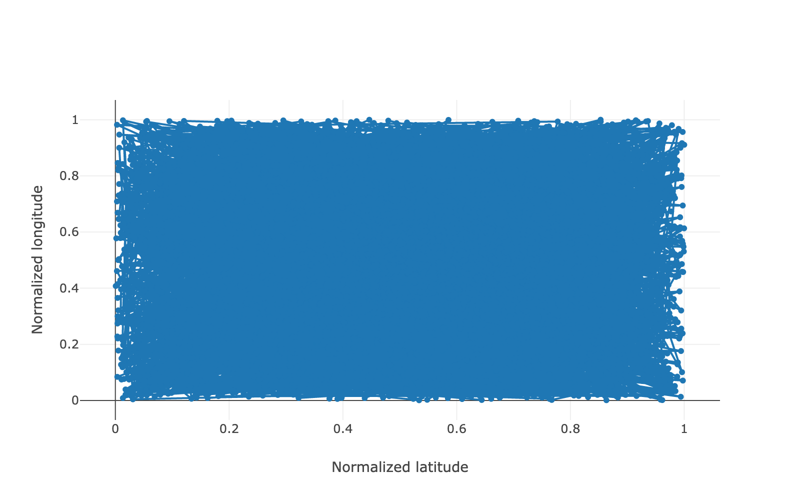
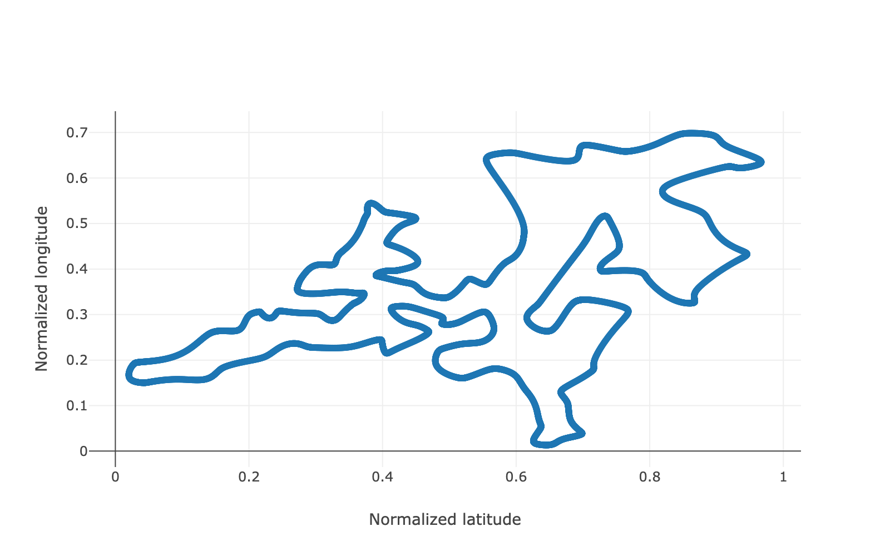
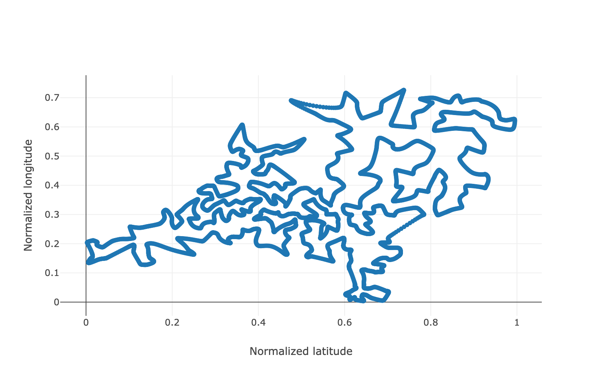
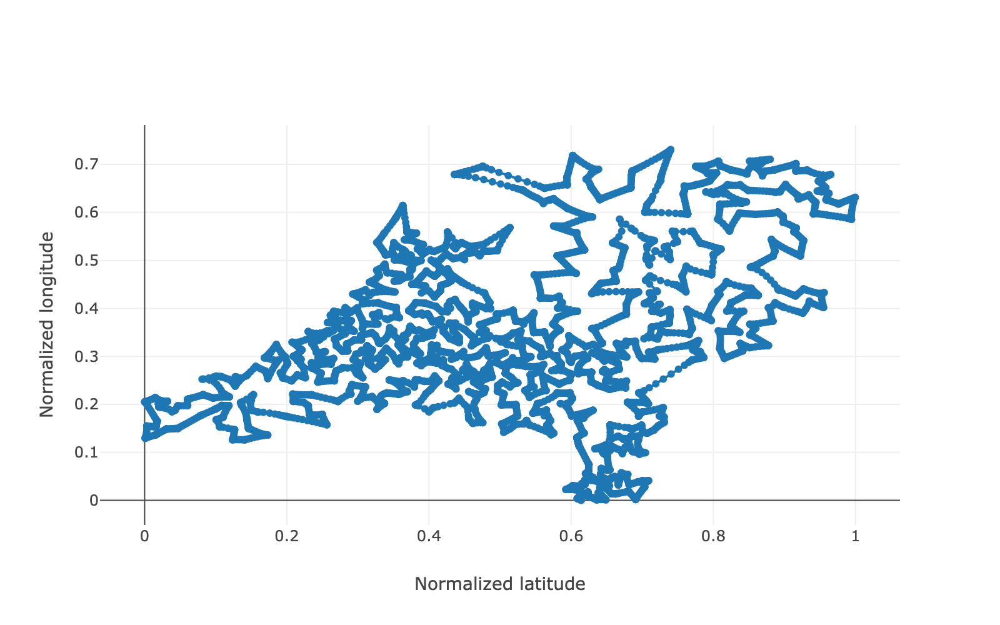

[](./LICENSE)

---

### Description
Small console app for creating using self-organising maps to get sub-optimal solution for the traveling salesman problem.

### Example
```bash
./run_program.sh ./data/nl.csv
```

<table>
  <tr>
    <td>0 iterations</td>
    <td>5,000 iterations</td>
    <td>10,000 iterations</td>
  </tr>
  <tr>
    <td></td>
    <td></td>
    <td></td>
  </tr>
  <tr>
    <td>15,000 iterations</td>
    <td>20,000 iterations</td>
    <td>25,000 iterations</td>
  </tr>
  <tr>
    <td></td>
    <td></td>
    <td></td>
  </tr>
 </table>